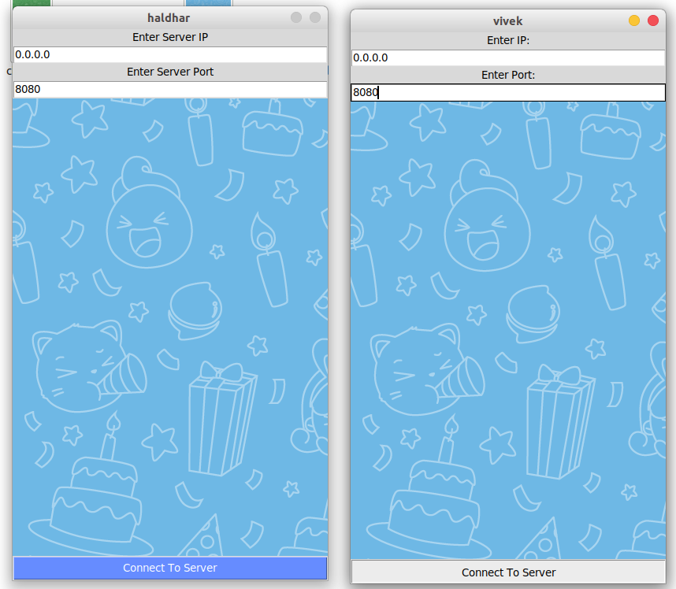
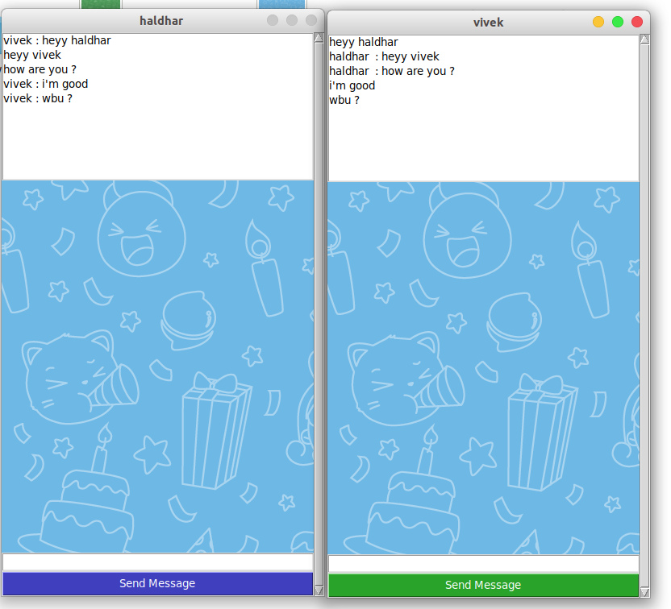

# RSA algorithm :
RSA is  asymmetric cryptography algorithm. Asymmetric actually means that it works on two different keys i.e. Public Key and Private Key. As the name describes that the Public Key is given to everyone and Private key is kept private.

An example of asymmetric cryptography :

A client (for example browser) sends its public key to the server and requests for some data.
The server encrypts the data using client’s public key and sends the encrypted data.
Client receives this data and decrypts it

### To Run The porgram First Run The server and open a port for connection

``` 
python3 server.py
```
 ### Now Run The client Script and connect to the host server
``` 
python3 client.py
```



